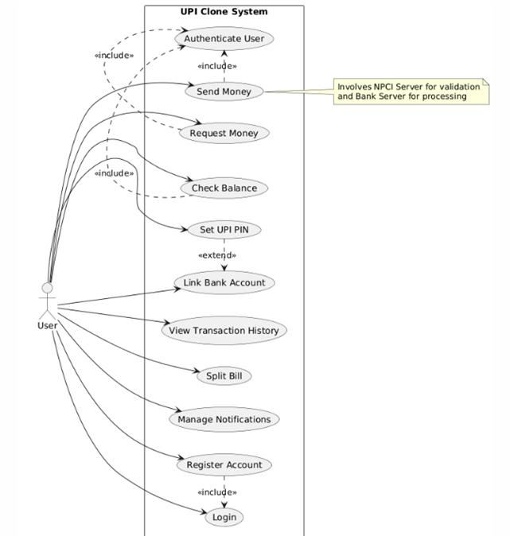
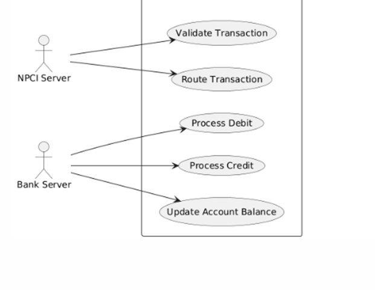
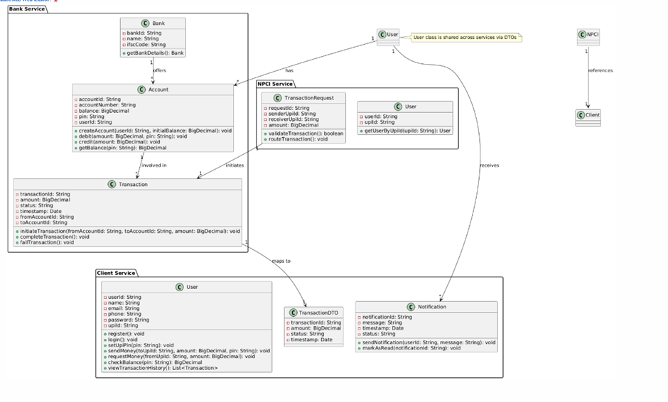
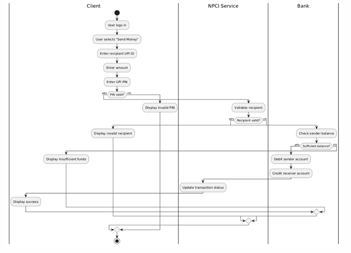
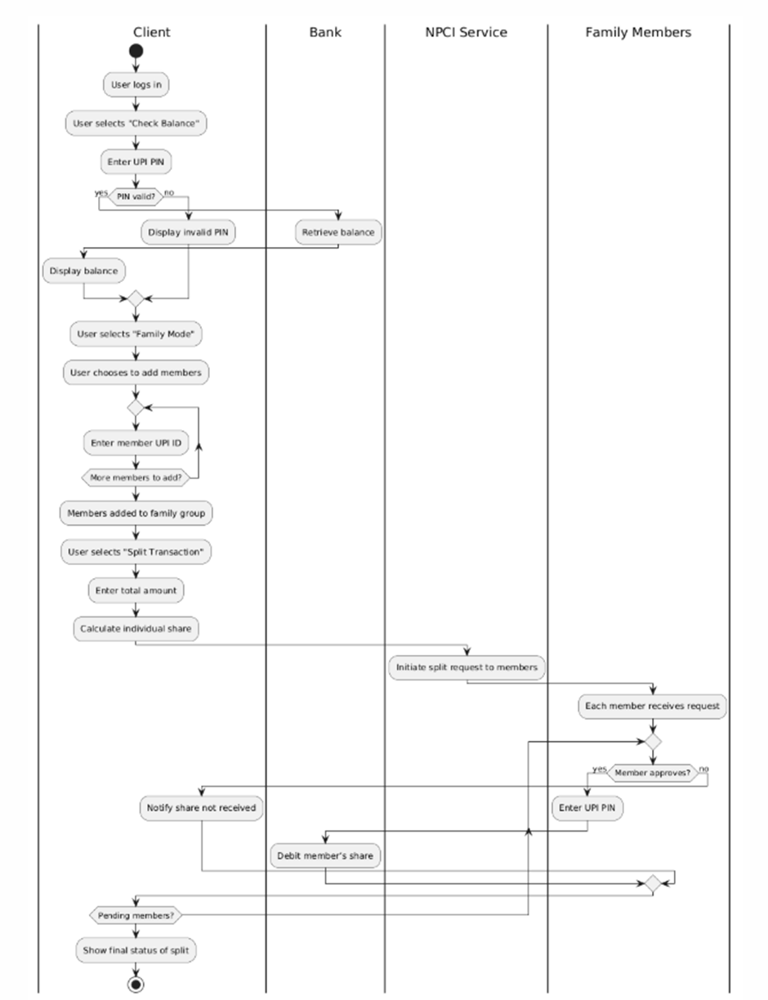

# UPI Clone

## Overview

The **UPI Clone** is a microservices-based application that replicates the core functionalities of the Unified Payments Interface (UPI) system. Built using **Spring Boot** and adhering to the **Model-View-Controller (MVC)** architecture, the project enables users to perform real-time financial transactions, such as sending and receiving money, checking account balances, linking bank accounts, and managing notifications. It consists of three microservices:

- **Client Service**: Handles user interactions, including authentication, transaction initiation, split bill functionality, and notifications.
- **Bank Service**: Manages bank accounts, processes debits/credits, and maintains transaction records.
- **NPCI Service**: Validates and routes transactions between banks, simulating the role of the National Payments Corporation of India (NPCI).

The project follows **SOLID** and **GRASP** principles, ensuring a modular, scalable, and maintainable design. It incorporates advanced features like UPI PIN setup, transaction history, and split bill functionality, making it a comprehensive simulation of a UPI system.

### Key Features

- User registration and secure authentication
- Bank account linking and UPI PIN setup
- Money transfer (send/receive) and balance inquiry
- Transaction history and notification management
- Split bill functionality for shared expenses
- Secure transaction processing with NPCI validation

### Technology Stack

- **Backend**: Spring Boot, Java
- **Database**: Configurable (e.g., MySQL, PostgreSQL, H2 for testing)
- **Frontend**: Thymeleaf templates, HTML, CSS, JavaScript
- **Build Tool**: Maven
- **Containerization**: Docker, Docker Compose
- **Security**: Spring Security for authentication and authorization
- **Communication**: HTTP REST APIs between microservices

## Project Structure

```
.
├── README.md
├── app.sh
├── bank-service
│   ├── Dockerfile
│   ├── pom.xml
│   ├── src
│   │   └── main
│   │       ├── java/com/xai/upi/bank
│   │       └── resources
│   └── target
├── client
│   ├── Dockerfile
│   ├── pom.xml
│   ├── src
│   │   └── main
│   │       ├── java/com/xai/upi/client
│   │       └── resources
│   └── target
├── npci-service
│   ├── Dockerfile
│   ├── pom.xml
│   ├── src
│   │   └── main
│   │       ├── java/com/xai/upi/npci
│   │       └── resources
│   └── target
├── docker-compose.yml
└── pom.xml
```

## Prerequisites

To run the project, ensure you have the following installed:

- **Java**: JDK 17 or higher
- **Maven**: 3.6.0 or higher
- **Docker**: Latest version (for Docker setup)
- **Docker Compose**: Latest version
- **Database**: MySQL/PostgreSQL (or H2 for local testing)
- **Git**: For cloning the repository

## Setup Instructions

### Running Without Docker (Locally)

The current implementation is configured to run on `localhost`. Follow these steps to set up and run the project locally.

1. **Clone the Repository**

   ```bash
   git clone https://github.com/ASHLESHA05/UpiClone.git
   cd UpiClone
   ```

2. **Configure Database**

    - Install MySQL or PostgreSQL locally, or use H2 for testing.
    - Create a database (e.g., `upi_clone_db`).
    - Update the `application.properties` files in each microservice (`bank-service`, `client`, `npci-service`) under `src/main/resources`.

   **Example** `application.properties` **for MySQL**:

   ```properties
   spring.datasource.url=jdbc:mysql://localhost:3306/upi_clone_db
   spring.datasource.username=<your-username>
   spring.datasource.password=<your-password>
   spring.jpa.hibernate.ddl-auto=update
   spring.jpa.show-sql=true
   server.port=<port> # e.g., 8081 for bank-service, 8082 for client, 8083 for npci-service
   ```

   **For H2 (Testing)**:

   ```properties
   spring.datasource.url=jdbc:h2:mem:testdb
   spring.datasource.driverClassName=org.h2.Driver
   spring.datasource.username=sa
   spring.datasource.password=
   spring.jpa.database-platform=org.hibernate.dialect.H2Dialect
   server.port=<port>
   ```

   **Notes**:

    - Ensure unique ports for each microservice (e.g., 8081, 8082, 8083).
    - Update `spring.datasource.url`, `username`, and `password` based on your database setup.
    - For `client`, ensure API endpoints point to `localhost` for `bank-service` and `npci-service`:

      ```properties
      bank.service.url=http://localhost:8081/api
      npci.service.url=http://localhost:8083/api
      ```

3. **Build the Project**

   ```bash
   mvn clean install
   ```

4. **Run Each Microservice**Open separate terminal windows for each microservice and run:

   ```bash
   # Bank Service
   cd bank-service
   mvn spring-boot:run
   ```

   ```bash
   # Client Service
   cd client
   mvn spring-boot:run
   ```

   ```bash
   # NPCI Service
   cd npci-service
   mvn spring-boot:run
   ```

5. **Access the Application**

    - **Client UI**: Open `http://localhost:8082` in your browser.
    - **Bank Service APIs**: Access endpoints like `http://localhost:8081/api/accounts`.
    - **NPCI Service APIs**: Access endpoints like `http://localhost:8083/api/transactions`.

### Running With Docker

Docker simplifies deployment by containerizing the microservices and database.

1. **Ensure Docker and Docker Compose are Installed**

   ```bash
   docker --version
   docker-compose --version
   ```

2. **Update** `docker-compose.yml`The provided `docker-compose.yml` defines services for `bank-service`, `client`, `npci-service`, and a database (e.g., MySQL). Ensure it includes environment variables for database credentials and service ports.

   **Example** `docker-compose.yml`:

   ```yaml
   version: '3.8'
   services:
     mysql:
       image: mysql:8.0
       environment:
         MYSQL_ROOT_PASSWORD: root
         MYSQL_DATABASE: upi_clone_db
       ports:
         - "3306:3306"
       volumes:
         - mysql-data:/var/lib/mysql
     bank-service:
       build: ./bank-service
       ports:
         - "8081:8081"
       environment:
         SPRING_DATASOURCE_URL: jdbc:mysql://mysql:3306/upi_clone_db
         SPRING_DATASOURCE_USERNAME: root
         SPRING_DATASOURCE_PASSWORD: root
       depends_on:
         - mysql
     client:
       build: ./client
       ports:
         - "8082:8082"
       environment:
         SPRING_DATASOURCE_URL: jdbc:mysql://mysql:3306/upi_clone_db
         SPRING_DATASOURCE_USERNAME: root
         SPRING_DATASOURCE_PASSWORD: root
         BANK_SERVICE_URL: http://bank-service:8081/api
         NPCI_SERVICE_URL: http://npci-service:8083/api
       depends_on:
         - mysql
         - bank-service
         - npci-service
     npci-service:
       build: ./npci-service
       ports:
         - "8083:8083"
       environment:
         SPRING_DATASOURCE_URL: jdbc:mysql://mysql:3306/upi_clone_db
         SPRING_DATASOURCE_USERNAME: root
         SPRING_DATASOURCE_PASSWORD: root
       depends_on:
         - mysql
   volumes:
     mysql-data:
   ```

   **Notes**:

    - Update `SPRING_DATASOURCE_URL`, `USERNAME`, and `PASSWORD` if using a different database.
    - Ensure `BANK_SERVICE_URL` and `NPCI_SERVICE_URL` in the `client` service point to the service names (`bank-service`, `npci-service`) for Docker networking.

3. **Build and Run with Docker Compose**

   ```bash
   docker-compose up --build
   ```

4. **Access the Application**

    - **Client UI**: `http://localhost:8082`
    - **Bank Service APIs**: `http://localhost:8081/api`
    - **NPCI Service APIs**: `http://localhost:8083/api`

5. **Stop the Containers**

   ```bash
   docker-compose down
   ```

## Configuration Changes

The current implementation assumes `localhost` for inter-service communication. To adapt for production or different environments, modify the following in `application.properties`:

- **Client Service** (`client/src/main/resources/application.properties`):

    - Update `bank.service.url` and `npci.service.url` to point to production URLs or Docker service names.
    - Example for Docker:

      ```properties
      bank.service.url=http://bank-service:8081/api
      npci.service.url=http://npci-service:8083/api
      ```

- **Database Configuration**:

    - Replace `spring.datasource.url` with your production database URL (e.g., AWS RDS, Google Cloud SQL).
    - Update `spring.datasource.username` and `spring.datasource.password` accordingly.

- **Ports**:

    - Ensure `server.port` is unique for each microservice and matches the Docker configuration.

- **Security**:

    - Configure Spring Security properties (e.g., JWT secrets) for production.
    - Example:

      ```properties
      jwt.secret=<your-secret-key>
      jwt.expiration=86400000
      ```

**Note**: The current `localhost` setup is suitable for development and testing. For production, secure the APIs with HTTPS and use environment variables for sensitive data.

## Diagrams

### Use Case Diagram

The use case diagram illustrates the interactions between actors (User, Bank Admin, NPCI Server, Bank Server) and the system.




### Class Diagram

The class diagram models the key entities and their relationships across the microservices.



### Activity Diagrams

Activity diagrams are provided for major use cases, detailing the flow of actions.

- **Send Money**

- **Request Money**

- **Check Balance**

- **View Transaction History**

[//]: # (### State Diagrams)

[//]: # ()
[//]: # (State diagrams show the lifecycle of key classes in the system.)

[//]: # ()
[//]: # (- **Transaction**&lt;&lt;image: Rendered Transaction State Diagram&gt;&gt;)

[//]: # ()
[//]: # (- **Account**&lt;&lt;image: Rendered Account State Diagram&gt;&gt;)

[//]: # ()
[//]: # (- **User**&lt;&lt;image: Rendered User State Diagram&gt;&gt;)

[//]: # ()
[//]: # (- **Notification**&lt;&lt;image: Rendered Notification State Diagram&gt;&gt;)

## Design Principles and Patterns

### SOLID Principles

The project adheres to SOLID principles to ensure maintainable and scalable code:

- **Single Responsibility Principle (SRP)**: Each class has a single purpose, e.g., `AccountService` manages account operations, while `TransactionController` handles transaction requests.
- **Open/Closed Principle (OCP)**: Classes are open for extension (e.g., new transaction types) but closed for modification, using interfaces and dependency injection.
- **Liskov Substitution Principle (LSP)**: Subclasses (e.g., specific transaction types) can replace their base classes without affecting functionality.
- **Interface Segregation Principle (ISP)**: Clients interact with specific interfaces (e.g., `UserRepository`) rather than bloated ones.
- **Dependency Inversion Principle (DIP)**: High-level modules depend on abstractions, implemented via Spring’s dependency injection.

### GRASP Principles

The project follows GRASP principles for effective responsibility assignment:

- **Information Expert**: Classes like `Account` handle operations related to account data, as they hold the relevant information.
- **Low Coupling**: Microservices communicate via HTTP APIs, minimizing dependencies.
- **High Cohesion**: Each microservice focuses on a specific domain (e.g., client for user interactions).
- **Controller**: MVC controllers (e.g., `BankController`) mediate between the UI and business logic.

### Design Patterns

The project utilizes several design patterns to solve common problems:

- **Model-View-Controller (MVC)**: Separates concerns into Model, View, and Controller, used in all microservices for structured development.
- **Repository**: Abstracts data access logic, e.g., `UserRepository` and `TransactionRepository`.
- **Data Transfer Object (DTO)**: Transfers data between layers, e.g., `TransactionDTO` and `NotificationDTO`.
- **Singleton**: Ensures a single instance of a class, managed by Spring’s dependency injection.

**Justification**: These principles and patterns were chosen to ensure the system is modular, testable, and adaptable to future changes, aligning with best practices in microservices design.

## Current Implementation Notes

- The project is configured to run on `localhost` with default ports (8081 for `bank-service`, 8082 for `client`, 8083 for `npci-service`).
- Database connections are set up for H2 (in-memory) or MySQL, depending on the `application.properties` configuration.
- Inter-service communication uses HTTP REST APIs, with URLs hardcoded to `localhost` in the `client` service.
- Security is implemented using Spring Security, but production-grade features like OAuth2 or SSL are not fully configured.

## Troubleshooting

- **Database Connection Issues**: Verify database URL, username, and password in `application.properties`. Ensure the database server is running.
- **Port Conflicts**: Check if ports 8081, 8082, or 8083 are in use. Update `server.port` if needed.
- **Docker Networking**: Ensure service names in `docker-compose.yml` match those in `application.properties` for inter-service communication.
- **Maven Build Errors**: Run `mvn clean install` to resolve dependency issues.

## Future Enhancements

- Add support for OAuth2 or UPI QR code scanning.
- Implement real-time notifications using WebSockets.
- Integrate with external payment gateways for production use.
- Enhance UI with a modern frontend framework (e.g., React, Angular).

## Contributors

- &lt;input: Team Member 1 Name&gt; - Client service and UI
- &lt;input: Team Member 2 Name&gt; - NPCI service and transaction routing
- &lt;input: Team Member 3 Name&gt; - Bank service and account management
- &lt;input: Team Member 4 Name&gt; - Database design and security

## License

This project is licensed under the MIT License. See the LICENSE file for details.